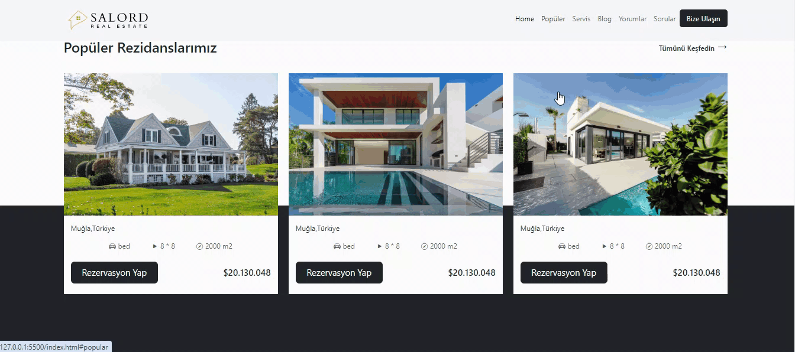

<h1> bootstraprealestate </h1>

This project represents a real estate website designed swiftly by leveraging the Bootstrap framework along with HTML and CSS technologies. The site showcases page layouts, style elements, and interactive components using ready-made elements. It offers a user-friendly platform featuring popular destinations and different options through various animations. Modern design elements and impressive visuals enrich the user experience, providing visitors with the opportunity to explore their choices.

<h2> The technologies used in the project </h2>

It was coded using Bootstrap, HTML and CSS
technologies.

<h2> Screenshot </h2>

# bootstraprealestate
